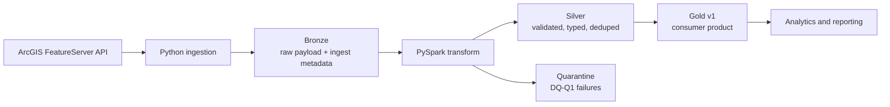

# University Chapters Azure Medallion Data Product

## Status

This repository is currently at the design and documentation stage. The README defines the implementation contract and acceptance criteria for the Bronze -> Silver -> Gold pipeline. Application code is intentionally not included in this step.

## Requirement / Problem

Build a thin, reusable data product containing university chapter data from the public ArcGIS FeatureServer API. The consumer-facing Gold layer must have a stable schema, explicit ownership, documented quality behavior, and a reproducible local run path.

The pipeline scope is limited to these USPS states:

| State | Code | Expected behavior |
| --- | --- | --- |
| California | `CA` | Non-zero baseline expected |
| Oregon | `OR` | May be empty |
| Washington | `WA` | May be empty |

An empty OR or WA result is a valid source observation. A whole-batch empty result, or an unexpected CA zero, must be surfaced rather than silently published as a successful empty product.

## Source API

- FeatureServer layer: `https://services2.arcgis.com/5I7u4SJE1vUr79JC/arcgis/rest/services/UniversityChapters_Public/FeatureServer/0`
- Query endpoint: append `/query`
- Hub page: `https://gis.ducks.org/datasets/du-university-chapters/api`
- The Hub page is documentation only. The pipeline calls the FeatureServer REST endpoint and does not scrape the Hub page as JSON.
- The source layer is point geometry in WGS84. The upstream view already filters `Status = 'ACTIVE'`.
- No credentials are required. No secrets should be committed.

### Verified API check

On 2026-09-09, the required query returned HTTP success and three features:

```bash
curl --fail-with-body --silent --show-error --location --get \
  'https://services2.arcgis.com/5I7u4SJE1vUr79JC/arcgis/rest/services/UniversityChapters_Public/FeatureServer/0/query' \
  --data-urlencode "where=State IN ('CA','OR','WA')" \
  --data-urlencode 'outFields=*' \
  --data-urlencode 'returnGeometry=true' \
  --data-urlencode 'f=json'
```

The observed sample was `CA-0355`, California Polytechnic State University, San Luis Obispo, CA, with longitude `-120.66319100299995` and latitude `35.274309145000075`. The response contained `features`, `fields`, `geometryType`, and `spatialReference`; the feature geometry used `x`/`y` coordinates.

The live response is evidence of the source contract, not a test fixture. Tests must remain deterministic by using a checked-in fixture or an injected Bronze payload.

### Source-to-product mapping

| Source field | Published field | Transformation |
| --- | --- | --- |
| `ChapterID` | `chapter_id` | Preserve as the stable business key |
| `University_Chapter` | `chapter_name` | Rename only |
| `City` | `city` | Trim and evaluate DQ-W1 |
| `State` | `state` | Keep only `CA`, `OR`, and `WA` |
| `geometry.x` | `longitude` | Cast to double; validate with DQ-Q1 |
| `geometry.y` | `latitude` | Cast to double; validate with DQ-Q1 |
| `OBJECTID` | `source_object_id` | Optional technical metadata; exclude from Gold |

## Recommended Architecture



### Layer responsibilities

| Layer | Purpose | Required behavior |
| --- | --- | --- |
| Bronze | Preserve the API payload as received, with run metadata | No business transformations; append history by run |
| Silver | Produce one typed, flattened row per chapter | Apply coordinate hard-fail logic and city warning logic; deduplicate by `chapter_id` |
| Gold | Publish the consumer-facing product | Include clean and warned rows only; never include quarantined rows |
| Quarantine | Preserve rows rejected by hard DQ rules | Store the raw payload, `ingest_run_id`, and a reason code for investigation and replay |

Suggested local or ADLS-style layout:

```text
bronze/university_chapters/<run_id>/
silver/university_chapters/
gold/university_chapters/v1/
quarantine/university_chapters/<run_id>/
```

The first implementation may use local Parquet or Delta-compatible paths. Production deployment may map these paths to ADLS Gen2 and run the Spark transform on Databricks, Fabric Spark, or Synapse Spark.

## Data Flow

1. Generate an `ingest_run_id` and request the FeatureServer `/query` endpoint.
2. Apply the explicit filter `State IN ('CA','OR','WA')`.
3. Store the raw response and metadata in Bronze, including request time, source URL, and run ID.
4. Flatten `attributes` and `geometry.x`/`geometry.y` into the chapter grain with PySpark.
5. Apply DQ-Q1 first. Quarantine invalid coordinate rows and exclude them from Silver and Gold.
6. Apply DQ-W1. Keep rows with a missing or unknown city, set `dq_status = 'WARNING'`, and append the warning code.
7. Publish clean and warned rows to Silver and Gold.
8. Log `rows_in`, `rows_quarantined`, `rows_warned`, and `rows_ok` for the run.
9. Run automated checks proving that quarantined rows do not appear in Gold and warned rows do appear with their warning code.

## Data Product Contract

### Ownership and use cases

- **Product name:** University Chapters Data Product
- **Technical owner:** Data Engineering team
- **Consumers:** Analytics, reporting, and downstream data products
- **Classification:** Public source data; no PII is expected
- **Grain:** One row per `chapter_id` in the published snapshot

### Gold interface: `gold/university_chapters/v1/`

| Column | Type | Nullable | Description |
| --- | --- | --- | --- |
| `chapter_id` | string | No | Stable business key, for example `CA-0355` |
| `chapter_name` | string | No | Published from `University_Chapter` |
| `city` | string | Yes | Published city; may be null when `dq_status = 'WARNING'` |
| `state` | string | No | USPS state code; one of `CA`, `OR`, `WA` |
| `longitude` | double | No | WGS84 longitude from `geometry.x` |
| `latitude` | double | No | WGS84 latitude from `geometry.y` |
| `dq_status` | string | No | `OK` or `WARNING` |
| `dq_warnings` | array<string> | No | Empty for `OK`; includes `MISSING_OR_UNKNOWN_CITY` for warnings |
| `ingest_run_id` | string | No | Run that produced the row |
| `ingested_at` | timestamp | No | UTC ingestion timestamp |

`OBJECTID` may be retained in Bronze or Silver as technical metadata under `source_object_id`, but it is not part of the required consumer contract.

### Data quality rules

| Rule | Severity | Failure condition | Action |
| --- | --- | --- | --- |
| `DQ-Q1` | Quarantine | Longitude or latitude is missing, null, non-numeric, longitude is outside `[-180, 180]`, or latitude is outside `[-90, 90]` | Exclude from Silver and Gold; write to quarantine with reason `INVALID_COORDINATES` |
| `DQ-W1` | Warning | `city` is null, blank, or the literal `UNKNOWN`, case-insensitive | Keep in Silver and Gold; set `dq_status = 'WARNING'` and include `MISSING_OR_UNKNOWN_CITY` |

Clean rows use `dq_status = 'OK'` and an empty warning collection. The fixture suite must include at least one DQ-Q1 row and one DQ-W1 row so both paths are observable even when the live API is clean.

### Freshness and batch rules

- Intended SLA: refreshed daily by 06:00 UTC.
- Manual local execution is acceptable for this exercise.
- Do not require OR or WA to have rows.
- Alert or fail when the entire batch is empty.
- Alert or fail when CA unexpectedly drops to zero, based on the selected baseline policy.
- API errors must fail loudly and must not publish an empty Gold result as success.

The batch decision is therefore:

| Observation | Decision |
| --- | --- |
| CA has rows, OR and/or WA are empty | Publish; record the state-level counts |
| Entire filtered response is empty | Fail or alert; do not publish an empty Gold success |
| CA has zero rows unexpectedly | Fail or alert according to the documented baseline policy |
| API request or response parsing fails | Fail the run; preserve diagnostics and do not publish Gold |

### Versioning and idempotency

Gold is published under `v1`. Breaking schema changes require a new versioned path or table rather than silently changing the existing interface.

The implementation must document its rerun strategy. A suitable local strategy is overwrite-by-run or deterministic replacement of the Gold snapshot. A production strategy may use an idempotent Delta `MERGE` keyed by `chapter_id`; rerunning the same input must not create unusable duplicate Gold records.

## Repository Run Contract

The implementation should provide a reproducible local path from a clean clone:

```bash
source ./setup.sh
# Run the ingestion and Bronze -> Silver -> Gold pipeline here.
# Run the automated checks here.
```

The future implementation must document the exact pipeline and test commands in this section. It should support an offline fixture mode so reviewers can verify DQ-Q1 and DQ-W1 without depending on the live API.

Until the implementation is added, the commands above are the setup contract rather than a claim that a pipeline command already exists. This keeps the README accurate while preserving the reviewer-facing run requirements.

Expected outputs after a successful fixture run:

- Bronze contains the raw fixture payload and run metadata.
- Silver contains valid clean and warned rows, but no invalid-coordinate row.
- Gold contains the clean row and the warned city row.
- Quarantine contains the invalid-coordinate row with `INVALID_COORDINATES`.
- Run metrics report `rows_in`, `rows_quarantined`, `rows_warned`, and `rows_ok`.

## Testing and Acceptance Criteria

The implementation is complete when all of the following are true:

- [ ] CA/OR/WA filtering is explicit.
- [ ] Required source fields map to the documented Gold schema.
- [ ] Bronze, Silver, Gold, and quarantine are visibly separate.
- [ ] Silver and Gold transformations use PySpark or a clearly Spark-shaped transform layer.
- [ ] DQ-Q1 quarantines invalid coordinates and excludes them from Gold.
- [ ] DQ-W1 publishes the row with `dq_status = 'WARNING'` and the expected warning code.
- [ ] A deterministic fixture demonstrates both DQ paths.
- [ ] Counts per run are logged.
- [ ] Empty OR/WA results do not fail the batch solely because they are empty.
- [ ] Empty whole-batch and unexpected CA-zero behavior is explicit.
- [ ] API failures fail loudly.
- [ ] Reruns are idempotent-ish and documented.
- [ ] Tests assert the hard-fail exclusion and warning pass-through.
- [ ] No secrets are committed.
- [ ] A reviewer can clone the repository and follow the README commands.

## Technology and Trade-offs

- **Python ingestion:** Simple HTTP integration for the public REST API; no credential wiring is needed.
- **PySpark transformation:** Makes schema, typing, deduplication, and distributed transformation logic reviewable and portable to Databricks, Fabric, or Synapse Spark.
- **Local storage first:** Keeps the take-home reproducible without requiring an Azure subscription. ADLS Gen2 paths and cloud execution are the production mapping.
- **Fixture-driven DQ tests:** Avoids coupling correctness tests to a changing external API while retaining a live smoke test for connectivity and response shape.
- **Out of scope:** Terraform/Bicep, CI/CD, schedulers, streaming, multi-environment promotion, production landing zones, and perfect SCD2 history.

## Production Follow-ups

For production, add managed identity and Key Vault only if credentials become necessary, private networking where required, centralized monitoring and alerting, schema/data-contract enforcement, source availability metrics, ADLS lifecycle policies, Delta maintenance, deployment automation, and an operational replay process. These are deliberately not required for this take-home assignment.

## Submission Checklist

1. Implement the documented pipeline and tests.
2. Run the exact commands documented above.
3. Verify that Gold materializes when CA data is available.
4. Verify that OR/WA being empty does not falsely fail the batch.
5. Confirm no secrets are present in Git history or tracked files.
6. Push the repository and grant access to the GitHub user or organization `dpl-tech-uk`.
7. Reply with the repository URL.
